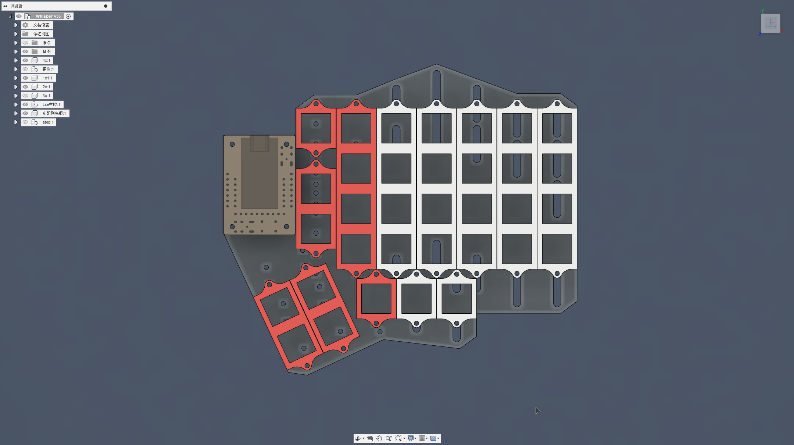

# Explorer Keyboard Whisper 探索者3號

## 前言

探索者系列鍵盤的特色為模組化，於是在探索者1號設計出來的時候就有一個想法，就是再設計一把非立體構造的鍵盤，於是探索者3號就這麼出現了。它參考了[IF-Ergolite](https://keyclicks.info/if-ergolite/)的鍵盤配列、其家族[Ergodash](https://github.com/omkbd/ErgoDash)、[Ergodox-ez](https://ergodox-ez.com/)、[Dactyl-Chimera](https://github.com/WolfIcefang/dactyl-chimera-keyboard)的滑軌定位方案、再根據初始壓克力外殼的Corne、Lily58pro的構造，合併在一起發想的分離式人體工學鍵盤。

## 特色

- 多功能底板：
  - 兩種拇指區類型：田字、單排。
  - 兩種拇指區排列。
  - 滑軌定位器可變更使用者手形。
- 1鍵、2鍵、3鍵、4鍵定位板：
  - 可根據底板上的螺絲孔位，進行配列變更。
- MX、Choc鍵軸支援：
  - 鍵盤使用M2螺絲及雙通銅柱做固定。
  - MX用6-7mm銅柱做固定。
  - Choc用5mm銅柱做固定。

## 構造

